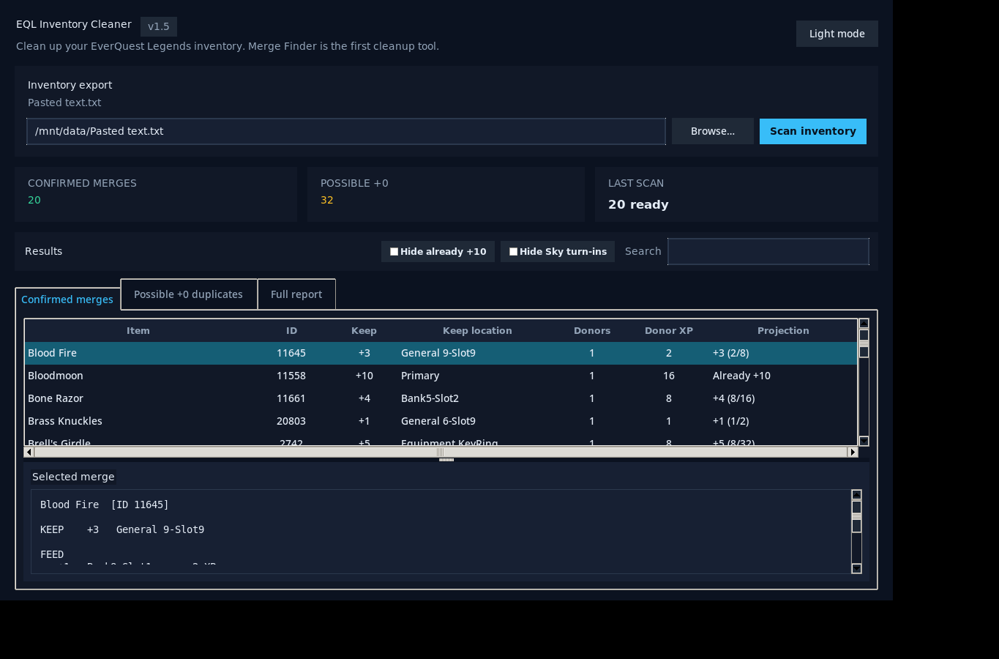

# EQL Inventory Cleaner

A read-only desktop utility for **EverQuest Legends** inventory exports. **EQL Inventory Cleaner** is designed as a home for multiple inventory-cleanup tools; the first module finds duplicate equipment that may be useful for EQL's item merging/upgrading system.

**Created and maintained by Metaljacx.**




## Current cleanup tools

### Merge Finder


- Finds duplicate gear by **EQL item ID**.
- Treats `+0`, `+1`, `+5`, etc. copies as the same base item.
- Reads inventory, bank, hoard, and **Equipment KeyRing** entries.
- Ignores Exaltation/Augmentation records as physical duplicate gear.
- Shows suggested **KEEP** and **FEED** copies, donor XP, and projected merge progress.
- Separates uncertain `+0` duplicates from confirmed merge candidates.
- Persistent **Hide already +10** filter.
- Persistent **Hide Sky turn-ins** filter using an EQL-specific Plane of Sky turn-in list.
- Remembers the last inventory file, browse folder, window size, theme, report folder, and filter settings.
- Modern light/dark Tkinter UI.
- Searchable and sortable result tables.
- Copy or save a full text report.
- Completely read-only: the program never changes your EQL inventory or game files.

## Download

For normal users, use the standalone files attached to a GitHub Release rather than running from source.

- **Windows:** `EQL-Inventory-Cleaner.exe`
- **Linux:** `EQL-Inventory-Cleaner`
- **Bazzite:** use the Linux standalone build or the optional Bazzite portable `.run` release asset when provided.

## Running from source

The application has no third-party runtime Python dependencies. It uses Python's standard library plus Tkinter.

### Windows

1. Install Python 3 with Tcl/Tk support.
2. Clone or download this repository.
3. Run:

```powershell
py eql_inventory_cleaner.py
```

### Linux

Python 3 and Tkinter are required when running directly from source.

Fedora:

```bash
sudo dnf install python3 python3-tkinter
python3 eql_inventory_cleaner.py
```

Ubuntu/Debian:

```bash
sudo apt install python3 python3-tk
python3 eql_inventory_cleaner.py
```

### Bazzite

For normal Bazzite use, prefer a standalone release build instead of layering Python/Tk packages onto the immutable base OS. Developers can run the source from an appropriate development environment/container with Python + Tkinter available.

## EQL inventory export

Create an inventory export in EverQuest Legends with `/outputfile inventory`, then select the generated text file using **Browse** in the app.

The parser supports UTF-16 EQL exports as well as UTF-8 copies of those exports.

## Merge Finder: how duplicate detection works

The scanner groups physical item copies by EQL item ID. This means differently upgraded versions of the same item are recognized together even when their displayed names differ by `+tier`.

The parser intentionally ignores `(Exaltation)` and KeyRing `Augmentation` records because those can reuse an item's ID without representing another physical copy that should be fed into gear.

When all duplicate copies are `+0` and none is proven to be equipment through the Equipment KeyRing, the group is placed under **Possible +0 duplicates** rather than being treated as a guaranteed merge candidate.

## Merge Finder: projections

The inventory export exposes an item's upgrade tier but does **not** expose partial item XP already accumulated within that tier. Because of that, projections assume the suggested KEEP copy starts at `0` partial XP in its current tier.

## Filters

### Hide already +10

Hides groups whose suggested KEEP target is already `+10` from the interactive confirmed list.

### Hide Sky turn-ins

Hides known EverQuest Legends Plane of Sky quest/test turn-in items from the interactive duplicate tables. The list is EQL-specific rather than a Project 1999 substitution.

The full report remains unfiltered so hidden groups are still available for review.

## Settings

Preferences are stored outside the app/repository and survive upgrades.

Linux/Bazzite:

```text
~/.config/eql-inventory-cleaner/settings.json
```

Windows:

```text
%APPDATA%\EQL Inventory Cleaner\settings.json
```

## Building standalone executables

PyInstaller is a **build-time** dependency only.

Install development requirements:

```bash
python -m pip install -r requirements-dev.txt
```

### Windows

```bat
build_windows.bat
```

Output:

```text
dist\EQL-Inventory-Cleaner.exe
```

### Linux

```bash
chmod +x build_linux.sh
./build_linux.sh
```

Output:

```text
dist/EQL-Inventory-Cleaner
```

For broad Linux compatibility, build on an older supported Linux userspace rather than a very new distribution.

## Automated releases

The included GitHub Actions workflow builds Windows and Linux standalone artifacts. When you push a version tag such as `v1.5`, the workflow also creates a GitHub Release and attaches the binaries.

See [`docs/GITHUB_SETUP.md`](docs/GITHUB_SETUP.md) for the recommended repository name, description, topics, first-push commands, and release process.

## Contributing

Bug fixes and improvements are welcome. Please read [`CONTRIBUTING.md`](CONTRIBUTING.md) before submitting a pull request, especially for changes involving EQL-specific mechanics or quest data.

## Disclaimer

EQL Inventory Cleaner is an independent community utility. It is not affiliated with or endorsed by EverQuest Legends or Daybreak Game Company. EverQuest and related names are trademarks of their respective owners.

## License

Released under the **MIT License**. See [`LICENSE`](LICENSE).
